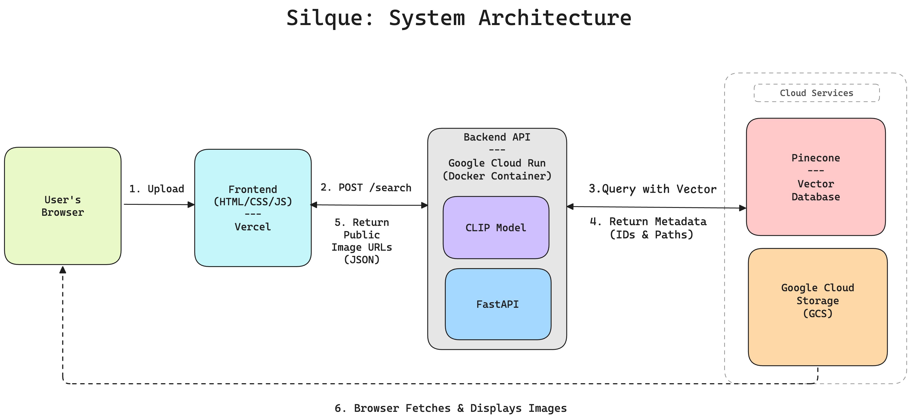

# Silque
### AI-Powered Visual Search Engine for Fashion

[](https://silque.vercel.app)
 
[](https://fastapi.tiangolo.com/)
 
[](https://cloud.google.com/)

Silque is an end to end, AI powered visual search engine for fashion. It allows users to upload an image of a clothing item and instantly discover stylistically similar products from a large catalog. This project was built to solve a real world discovery problem while demonstrating a mastery of modern cloud-native architecture, from local containerization with Docker to a scalable, serverless deployment on Google Cloud.

---

### Demo


---

### Core Features

*   **AI-Powered Visual Search:** Utilizes OpenAI's `clip-ViT-B-32` model to generate vector embeddings from images, capturing their semantic and stylistic essence.
*   **Real-Time Similarity Search:** Leverages **Pinecone**, a dedicated vector database, to perform highly efficient, low-latency similarity searches across the entire product catalog.
*   **Scalable Cloud Architecture:** The containerized FastAPI backend is deployed on **Google Cloud Run**, providing a serverless, auto-scaling infrastructure.
*   **Global Content Delivery:** Image assets are hosted on **Google Cloud Storage** for durable storage and fast, global access.
*   **Dynamic Frontend:** A responsive and polished user interface built with vanilla JavaScript, featuring dynamic layout transformations and asynchronous API communication.

---

### Tech Stack & Architecture

#### Architecture Diagram


#### Technologies Used:
*   **Frontend:** Vanilla JavaScript (ES6), HTML5, CSS3
*   **Backend:** Python, FastAPI
*   **AI / ML:** Sentence-Transformers (CLIP), Pinecone (Vector Database)
*   **Database & Storage:** Pinecone, Google Cloud Storage
*   **DevOps & Deployment:** Google Cloud Run, Google Cloud Storage, Docker, Vercel, GitHub Actions

---

### Challenges & Learnings

Building and deploying Silque involved solving several real-world engineering challenges:

*   **Cross-Platform Containerization:** The development environment (macOS on ARM) differed from the production environment (Google Cloud on x86). This was solved by implementing a multi-platform Docker build using the `--platform linux/amd64` flag.
*   **Cloud Resource Management:** The initial deployment failed due to insufficient memory for the AI model. I debugged this by analyzing cloud logs, identifying the OOM (Out Of Memory) error, and re-deploying the service with an increased memory allocation (from 512MiB to 4GiB).
*   **Production CORS Policy:** I implemented and debugged a strict Cross-Origin Resource Sharing (CORS) policy in FastAPI to securely allow requests from the deployed Vercel frontend while blocking others.
*   **Scalable Data Handling:** To avoid bloating the Docker image and enable an independent data pipeline, all image assets were decoupled from the application and served from Google Cloud Storage.

---

### Getting Started (Local Development)

#### Prerequisites
*   Docker Desktop installed
*   Google Cloud SDK (`gcloud`) installed and configured
*   A `.env` file in the project root with your `PINECONE_API_KEY`, `PINECONE_ENVIRONMENT`, and `GCS_BUCKET_NAME`. 

#### Running the Backend
1.  **Build the Docker image:**
    ```sh
    docker build -t silque-backend .
    ```
2.  **Run the container:**
    ```sh
    docker run -p 8000:8000 -v ./data:/app/data --env-file .env silque-backend
    ```
    The API will be available at `http://localhost:8000`.
